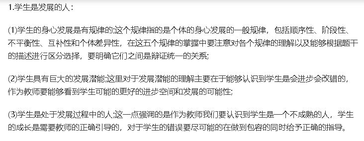

### 综合知识---常考知识点

> 主要记录试卷中常考的知识点，也就是重要的部分，进而做一个统计，看看哪个知识点考的最多

> 特别注意材料分析题的答题格式！采用总分总的格式  
    1. 首先对材料的事例进行评价  
    2. 列出每一个涉及的要点，加以解释说明，并结合材料  
    3. 总结  

1. 教师观 **(2019上NO.30)**

   > 教师角色的转变上
     - 从教师与学生的关系上看，教师应该成为学生学习的促进者。即想方设法提高学生学习的积极性，主动性。
     - 从教学与研究的关系上看，教师应该成为教学的研究者。将自己置身于教学情境之中，以研究者的眼光审视和分析教学理论和教学实践中的各种问题，并进行反思。
     - 从教学与课程的关系上看，教师应该成为课程的建设者和研究者。
     - 从学校与社区的关系上看，教师应该成为社区型开放教师。学校要引导学生积极参与社区的社会活动，社区要主动提供可供教育利用的社区资源。

   > 教师行为的转变上
     - 在对待师生关系上，强调尊重、赞赏。尊重每一位学生做人的尊严和价值，多发现学生身上的优点 
     - 在对待教学关系上，强调帮助、引导。帮助学生检视和反思自我，帮助学生寻找、搜集和利用学习资源，帮助学生对学习过程和结果进行评价，帮助学生发现自己的潜能
     - 在对待自我上，强调反思。对自己的教学不断地进行反思，促使教师形成自我反思的意识和自我监控的能力
     - 在对待与其他教育者的关系上，强调合作。教师之间要相互尊重、相互学习和团结互助才能教好学

2. 教师职业道德规范 **(2019上NO.31)**
   > 爱国守法：基本要求
     - 禁止性要求：不得有违背党和国家方针政策的言行

   > 爱岗敬业：教师职业的本质要求
     - 最基本要求表现：工作负责、认真备课、上课、认真辅导学生!
     - 最高表现：忠于教育、无私奉献、敢为人梯
     - 禁止性要求：不得敷衍塞责
    
   > 关爱学生：师德的灵魂
     - 对象：全体学生、平等公正
     - 方式：严慈相济、良师益友
     - 内容：保护安全、关心健康、维护权益，尊重学生人格，平等公正对待学生
     - 禁止性要求：不讽刺、挖苦、歧视，不体罚、变相体罚

   > 教书育人：教师的天职，不是教师的根本任务
     - 依据：遵循教育规律、实施素质教育
     - 方式：循循善诱、诲人不倦、因材施教 
     - 内容：培养学生的良好品行
     - 教书育人的重点：激发创新精神、促进全面发展
     - 禁止性要求：不以分数作为评价的唯一标准

   > 为人师表：教师职业的内在要求
     - 思想层面：道德高尚，知荣明耻，严于律己，以身作则
     - 行为层面：得体、规范、文明
     - 与外界的关系：关心集体，团结协作，尊重同事、尊重家长
     - 禁止性要求：自觉抵制有偿家教、不利用职务之便谋取私利
     - 是教师职业道德区别于其他职业道德的本质要求

   > 终生学习：不竭动力
     - 思想层面：崇尚科学精神，树立终身学习理念
     - 最终目的：不断提高专业素养和教育教学水平

2. “以人为本”的学生观

    - 
    - 
    - 