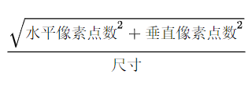

### 移动端适配

> 和网页的自适应不同，适配是针对不同手机的屏幕，通过一张设计稿，实现各屏幕无差异或者是极少差异展现。

#### 基础概念

1. **英寸**：用于描述手机的大小。1英寸 = 2.54厘米。

2. **分辨率**：
   > 像素：像素是基本的显示单位。显示屏上就是由无数个特定颜色和特定位置的像素组成的。
   - 屏幕分辨率：就是屏幕上具体有多少个像素点组成。宽度像素点*高度像素点。注意分辨率高不代表屏幕就很清晰。
   - 图片分辨率：就是指一张图片上具体有多少个像素点组成。
3. **设备像素密度PPI**(Pixel Per Inch)：每英寸(对角线尺寸)包含的像素数。计算公式是：

4. **DPI**(Dot Per Inch)：每英寸(对角线尺寸)包含的点数，这是一个抽象的单位，可以是屏幕像素点、图片像素点也可以是打印机的墨点。与PPI类似。

5. **设备独立像素**(density-independent pixel)：又称密度无关像素，就是可以由程序控制的虚拟像素(例如css像素)。可以认为写样式时，控制的px就是以它为准的。Google浏览器开发者工具的手机模拟器上的大小就是设备独立像素。

6. **设备像素比**(device pixel ratio)：即物理像素和设备独立像素的比值。
   - `window.devicePixelRatio`：在web中获取DPR。
   - `min-device-pixel-ratio`：在css使用媒体查询时，区分DPR。

7. **移动端开发**：使用的都是设备独立像素！ios中单位是pt，Android中单位是dp。

8. **web端开发**：当页面缩放为100%时，css像素就等于物理像素。

> 经常见到的1080P或者4K屏幕描述中，P代表屏幕纵向的像素个数，K代表屏幕横向的像素个数。 

#### viewport视口

1. **桌面端**：viewport的宽高就是浏览器的宽高。
    > 关于尺寸和位置的属性对
      - `screen.width/height`：屏幕的宽高，以物理像素为单位。
      - `window.innerWidth/innerHeight`：当前浏览器尺寸，包含滚动条，以css像素为单位。这里注意当放大浏览器时，此值会减少，当缩小时会增大。
      - `window.pageX/YOffset`：页面(document)相对于窗口原点的水平、垂直位移，以css像素为单位。注意不管是放大还是缩小，其滚动位移是不会改变的。
      - `document.documentElement.clientWidth/Height`：viewport的尺寸，以css像素为单位。注意viewport才影响`<html>`元素的大小。其实这个值和`window.innerWidth/innerHeight`的值类似，区别就是viewport的尺寸不包含滚动条。
    > 事件坐标
      - `e.pageX/Y`：以`<html>`元素为基准的事件触发点的坐标。
      - `e.clientX/Y`：以viewport为基准的事件触发点的坐标。
      - `e.screenX/Y`：以设备屏幕的事件触发点的坐标。
    > 媒体查询
      - `width/height`：与viewport宽度和高度一致。
      - `device-width/height`：与screen.width/height一致。

2. **移动端**：viewport分为两部分  
    - visual viewport：可见(虚拟)视口，就是你当前在屏幕上看到的，通常是网页的一部分。
    - layout viewport：布局视口，它通常比可见视口更宽，有一部分你可以在屏幕上看到，有的看不到，其实就是整个网页。`<html>`的宽度就是取决于它。layout viewport的宽度在每个浏览器上都不同，Safari：980px、Opera：850px、Android：800px、IE：974px
    > 将布局视口想象成**一张不能改变尺寸和形状的图片**，现在把它放到一个比它小的frame里,frame被不透明包裹着,这样你只能看到图片的一部分而不是全部(废话)，这个frame就是可见(虚拟)视口。你能够**缩小frame**来看到整个图片，**放大frame**来看图片的一部分。当然你也能改变frame的方向，但是图片的大小和形状不会改变。
    - 浏览器初始展示页面时都是最小缩放模式，这时layout viewport的width和height和visual viewport的相等。当你横向屏幕时，会进行自适应，还是达到竖屏的效果。一般来说layout viewport的宽度不会改变，但高度会变小。
    > 关于尺寸和位置的属性对
      - `document.documentElement.clientWidth/Height`：layout viewport的宽度和高度，以css像素为单位。
      - `window.innerWidth/Height`：visual viewport的宽度和高度，以css像素为单位。可变。
      - `screen.width/height`：屏幕的宽度和高度，以物理像素为单位。zoom缩放水平通过`window.innerWidth/screen.width`来衡量。
      - `window.pageX/pageYOffset`：滚动位移，即visual viewport相对于layout viewport的偏移量。
      - `document.documentElement.offsetWidth/Height`：html元素的整体宽高。
    > 事件坐标
      - `event.pageX/Y`：相对于layout viewport或者是<html>。
      - `event.clientX/Y`：相对于visual viewport。
      - `event.screenX/Y`：相对于屏幕，以物理像素为单位。
    > 媒体查询
      - `width/height`：与layout viewport的宽高一致。
      - `device-width/height`：与screen的宽高一致。
      - `meta viewport`：设置layout viewport的宽度。
