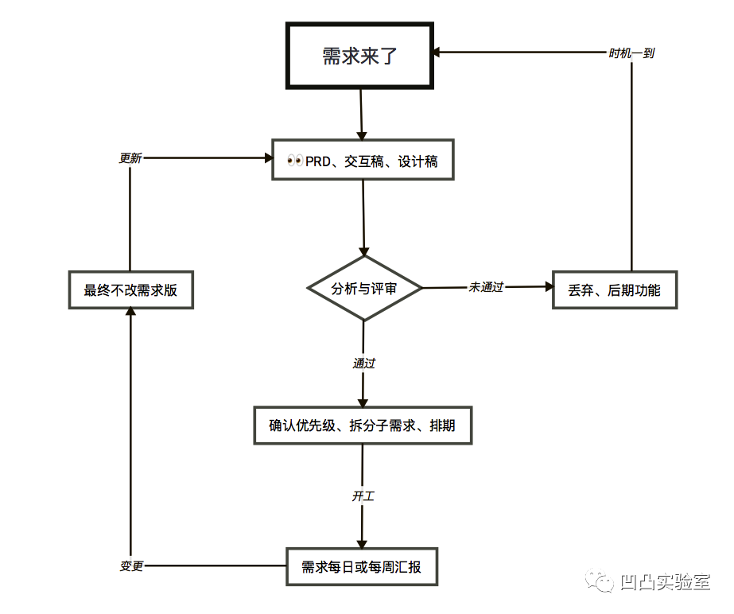
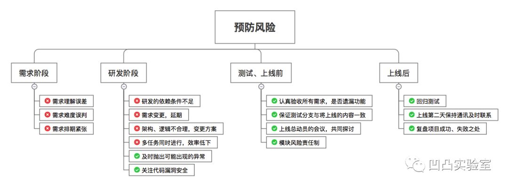

### 项目管理

> 为什么认为这个重要呢? 因为在实际开发中，真是有很多需要注意的地方，真的不是技术好就行了。对于需求什么的需要深入的理解，从而选择一个好的方案，加快开发速度。并不是一味地遇到需求就去一股脑地做，后果就是你会忙死的。

**需求管理流程图**

#### 分析与评审

做一个**会思考**的程序员，不是**逆来顺受**，可以引导产品经理，给出提醒并提供建设性的意见。这个貌似有点难啊~，哈哈哈。力求在开工之前，把**不清晰不完整的部分暴露出来**！清楚自己在某个时间段的工作重点，拒绝一些无意义的工作。

#### 需求排期

确认需求之后，就要对需求进行排期，也就是分清优先级。  
了解**主线需求 > 主线的分支需求 > 锦上添花的需求**，以**用户覆盖面、用户使用频次、对用户的重要程度**和四象限法则**重要且紧急 > 重要不紧急 > 紧急不重要 > 不重要也不紧急**为辅助去区分优先级。

#### 需求跟踪

需求进入开发后，就要汇报工作进展。汇报内容一般如下：  

1. 结果：进度如何，完成了哪些内容？
2. 计划：下周计划完成哪些内容？
3. 问题：讨论问题，找出问题的失误点、关键点、反思点、如何解决。 

#### 需求变更

这个不可避免，毕竟没有一开始就完美的东西！  
要**记录反馈的所有变更，拒绝不合理的需求**，可能会重新排期。

### 研发管理

> 针对实际开发时的管理操作。

#### 仓库管理

这个其实很重要，清晰易读的提交注释才能知道你干了什么事情嘛！一般提交要注意：  

1. 保证commit历史记录的简洁，一个commit只做一件事儿。
2. commit的注释要有规范。

### 风险管理

> 风险控制就是一开始就要考虑到可能存在的风险。

**各个阶段的预防风险图**

我认为很重要的是：  

1. 一定要在需求分析阶段理解好各个需求。
2. 开发过程中，有问题积极反应。

